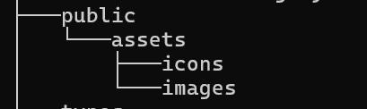
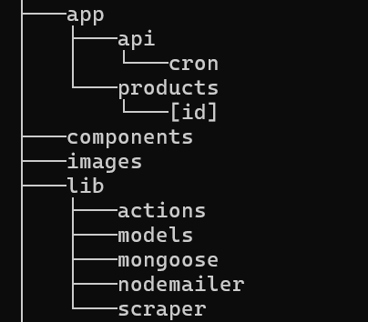
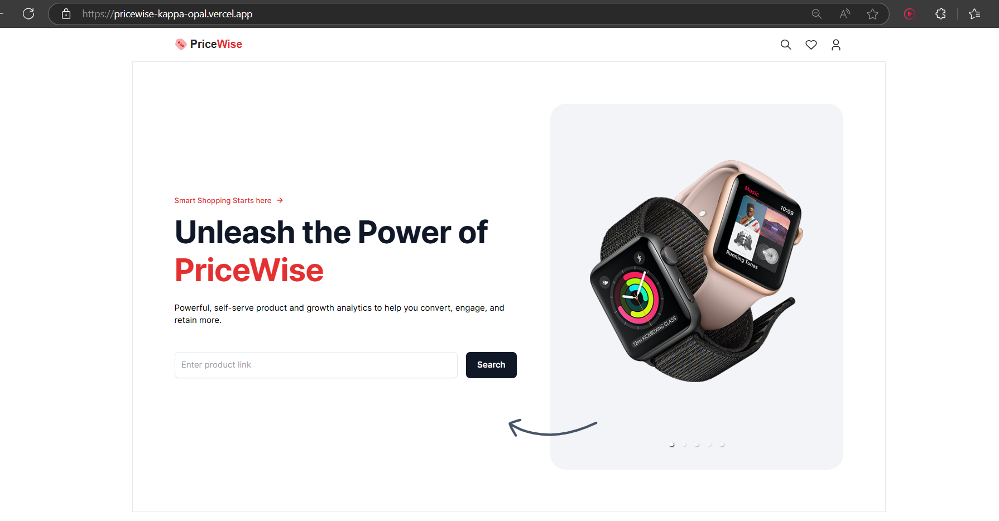
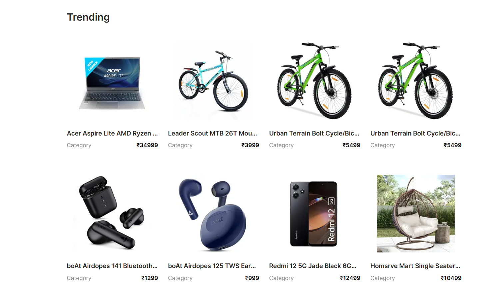
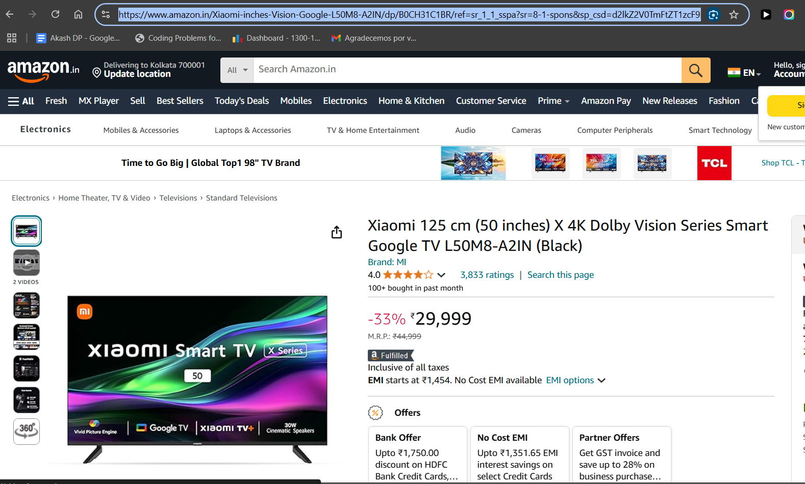
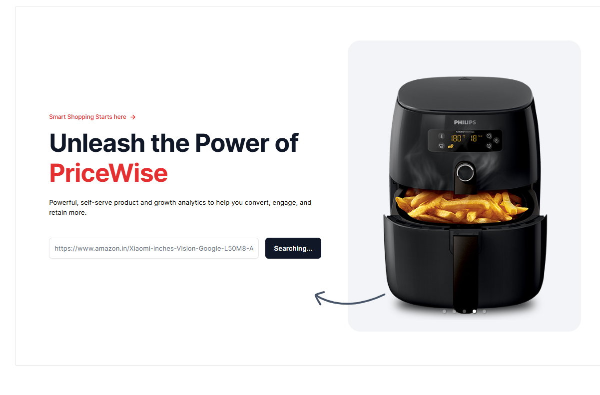
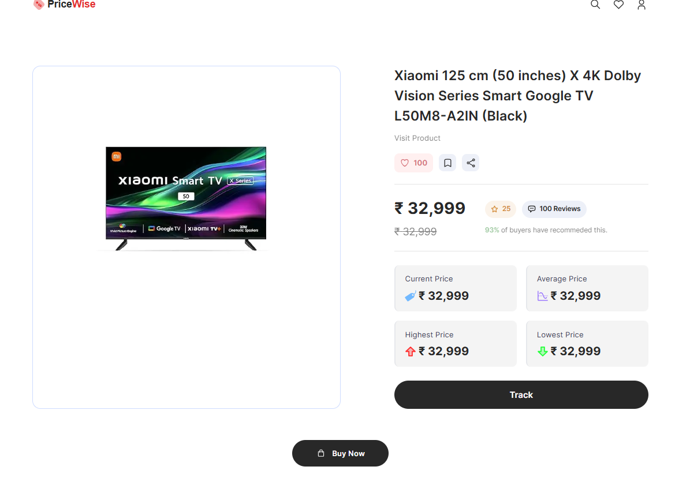
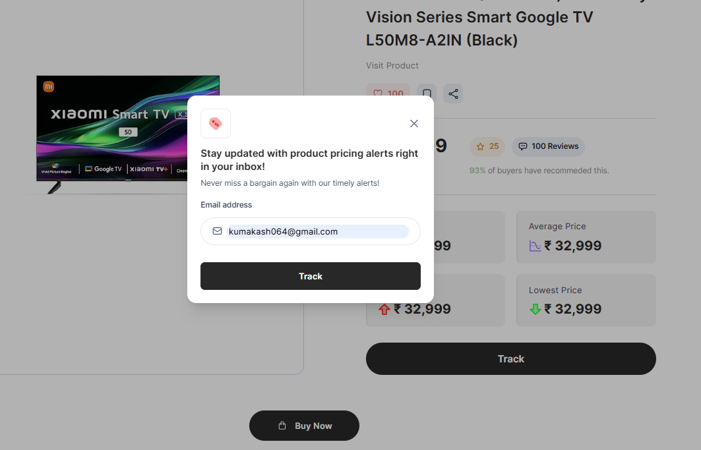
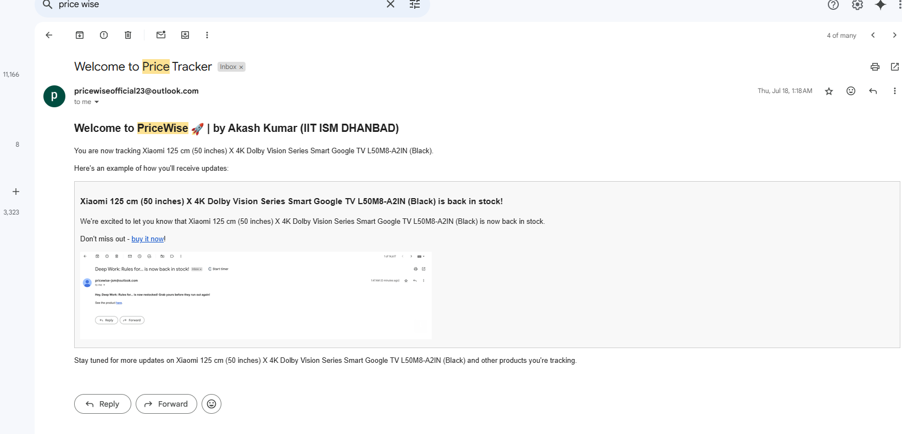

# Pricewise
 - This is a powerful web-scraping tool that tracks product data(prices, descriptions, availability) from platforms like Amazon, resulting in a 35% faster data retrieval compared to similar solutions.
 - Implemented cron-jobs that automated daily scraping-tasks,leading to 100% timely up dates on product changes and improving user engagement with 15% higher notification response rates.

## Technologies Used:

- Web Scraping: Cheerio, BrightData
- Frontend: React, Next.js
- Backend: Node.js, Node Mailer
- Database: MongoDB
- Automation: Cron Jobs
- Deployment: Vercel

## Folder Structure

-------
## Video Demo : 

## Screenshots

- Home page

------                    

- Amazon Product to be tracked (Xiaomi 125cm X 4K Dolby Vision Smart Google TV)

------

- Adding link of the product to track

------

- Prodct page

------          

- Adding email to get notifications

------                   

- Email notification received

------
## Demo Video

------

